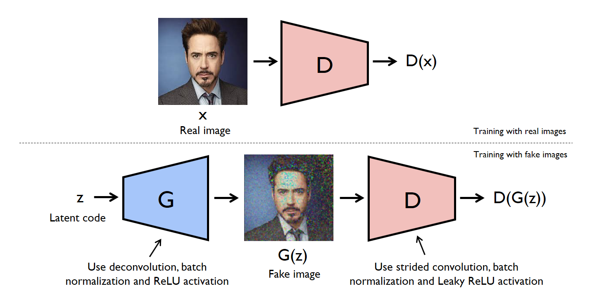
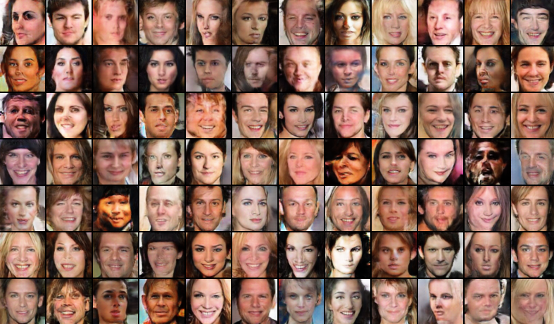
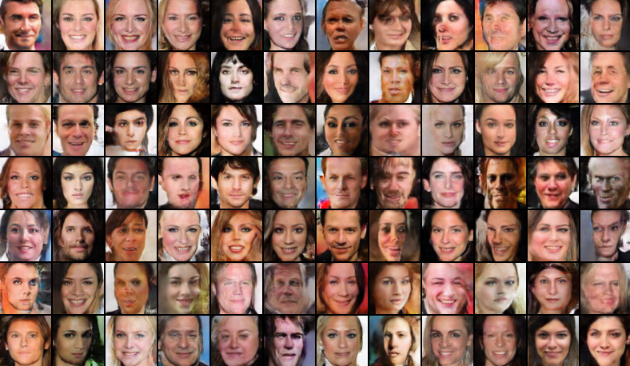

## Deep Convolutional GAN 
[Generative Adversarial Network](https://arxiv.org/abs/1406.2661) is a generative model that contains a discriminator and a generator.  The discriminator is a binary classifier that is trained to classify the real image as real and the fake image as fake. The discriminator is trained to assign 1 to the real image and 0 to the fake image.The generator is a generative model that creates an image from the latent code. The generator is trained to generate an image that can not be distinguishable from the real image in order to deceive the discriminator.

In the [Deep Convolutional GAN(DCGAN)](https://arxiv.org/abs/1511.06434), the authors introduce architecture guidlines for stable GAN training. They replace any pooling layers with strided convolutions (for the discriminator) and fractional-strided convolutions (for the generator) and use batchnorm in both the discriminator and the generator. In addition, they use ReLU activation in the generator and LeakyReLU activation in the discriminator. However, in our case, we use LeakyReLU activation in both models to avoid sparse gradients.




## Usage 

#### 1. Install the dependencies
```bash
$ pip install -r requirements.txt
```

#### 2. Download the dataset
```bash
$ chmod +x download.sh
$ ./download.sh
```

#### 3. Train the model
```bash
$ python main.py --mode='train'
```

#### 3. Sample the images
```bash
$ python main.py --mode='sample'
```


<br>

## Results

The following is the result on the CelebA dataset.



