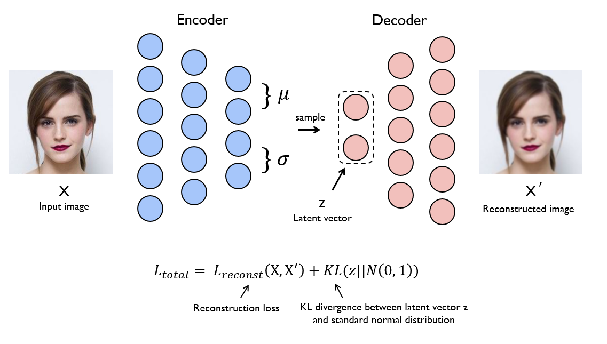
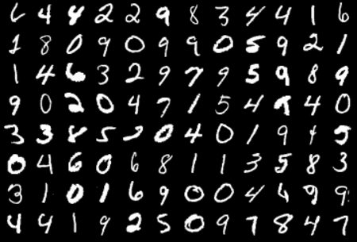
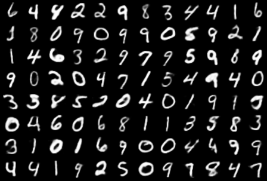

# Variational Auto-Encoder
[Variational Auto-Encoder(VAE)](https://arxiv.org/abs/1312.6114) is one of the generative model. From a neural network perspective, the only difference between the VAE and the Auto-Encoder(AE) is that the latent vector z in VAE is stochastically sampled. This solves the problem that the AE learns identity mapping and can not have meaningful representations in latent space. In fact, the VAE uses [reparameterization trick](https://github.com/yunjey/pytorch-tutorial/blob/master/tutorials/03-advanced/variational_auto_encoder/main.py#L40-L44) to enable back propagation without sampling z directly from the mean and variance.

#### VAE loss
As in conventional auto-encoders, the VAE minimizes the reconstruction loss between the input image and the generated image. In addition, the VAE approximates z to the standard normal distribution so that the decoder in the VAE can be used for sampling in the test phase.

<p align="center"></p>


## Usage 

```bash
$ pip install -r requirements.txt
$ python main.py
```

<br>

## Results
Real image        |  Reconstruced image
:-------------------------:|:-------------------------:
  |  
